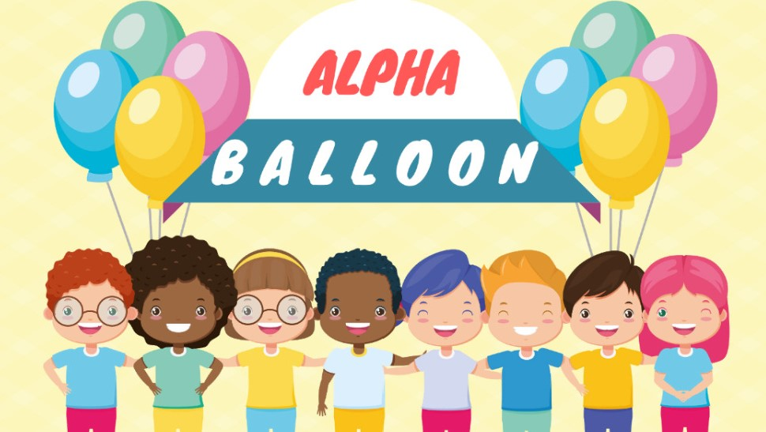
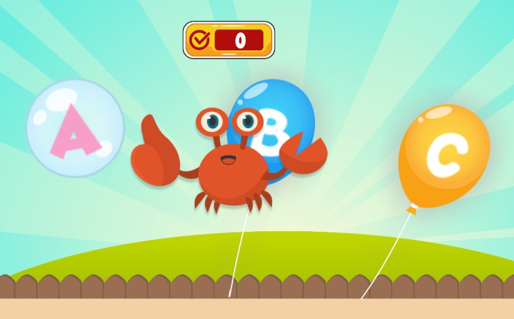
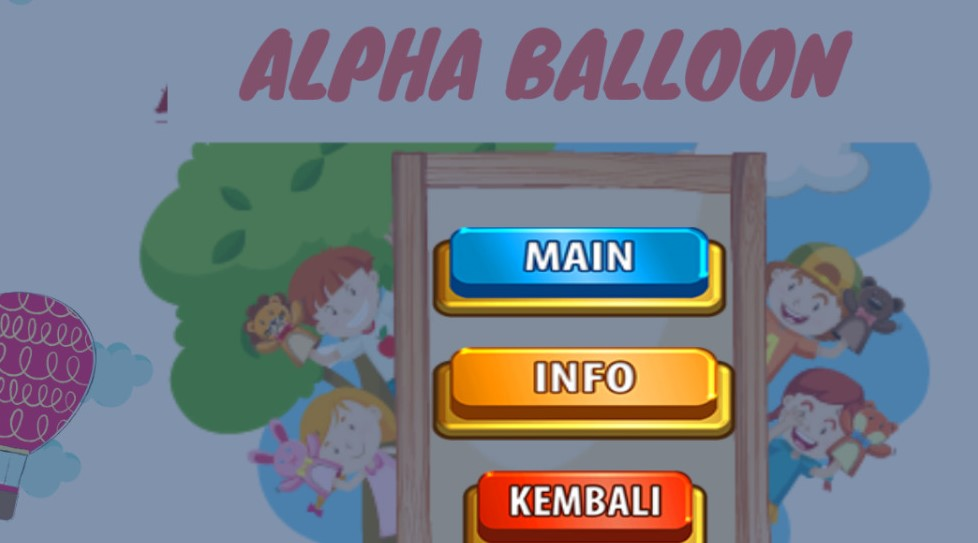
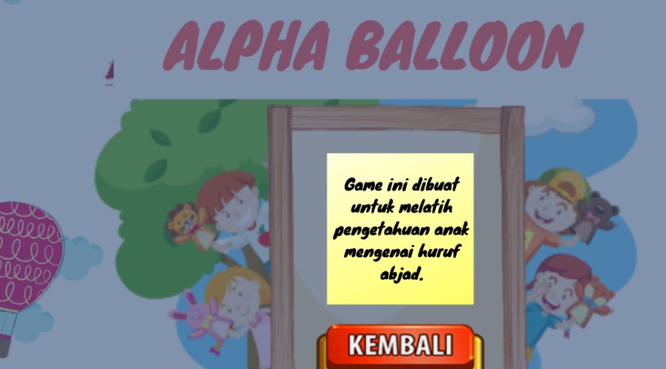

# Alpha-Ballon
Game ini merupakan (endless games) yang bertemakan education untuk anak-anak yang baru belajar mengenal huruf dan angka. 

## Development Team
| Game Designer | Game Artist | Game Programmer |
| ----- | ----- | ----- |
| Qarry Atul Chairunnisa  (G64170014) | Indah Puspita           (G64170035) | Siti Nur Hasanah        (G64170036) |

## Screenshot Game
Starting Prompt:  
  

Gameplay:  
  

Menu Utama :  
  

Info Menu:  
  

## Story Line
AlphaBalloon merupakan game endless education yang memiliki storyline dimana pemain menebak huruf dan angka yang disebutkan oleh narator dengan mengklik balon yang ditandai pilihan huruf dan angka. Pemain harus mampu menebak huruf dan angka agar bisa melanjutkan pertanyaan tebakan selanjutnya.

## Gameplay
Game ini bertujuan untuk memenangkan tebakan huruf alphabet dari A-Z dan angka 1-50. Setiap pemain yang mampu menebak dengan benar, akan memperoleh satu poin untuk  lanjut ke tebakan berikutnya. Setiap sesi memerlukan waktu 5 detik.  Tebakan yang benar ditandai oleh sebuah karakter yang memiliki ekspresi tertentu.

## Character
AlphaBallon menggunakan beberapa karakter diantaranya :
Balloon : karakter utama, tiap balon menampilkan angka dan huruf yang berbeda-beda.
Human : Karakter tambahan, yang mana ketika pemain berhasil menebak dengan benar atau salah  maka karakter ini akan menampilkan ekspresi tertentu.

## Concept dan Environment
Game ini bertemakan taman kanak-kanak, yang mana ketika akan menebak huruf suasana siang hari yang muncul dan ketika akan menebak angka  suasananya berubah menjadi malam hari. Ketika masuk ke game ini pemain akan diarahkan untuk memilih permainan untuk menebak huruf atau angka. Game ini juga akan diiringi dengan musik tertentu, untuk menambah suasana pada game.

## Action
- Balon menggantung di udara dengan pergerakan statis
- Pemain dapat mengklik  balon untuk memilih huruf atau angka yang benar menurutnya. Dari klik tersebut, akan menampilkan human character yang memiliki ekspresi tertentu; tertawa atau menangis.
- Game dapat di pause dengan tombol space.
- Game ini juga didukung oleh suara narator yang memberikan pertanyaan
- Human character juga memiliki suara tertawa atau menangis.

